# Guia de Integração da API Synapse

Este guia abrangente cobre a implementação completa da API para o sistema de gerenciamento de documentos e demandas Synapse, projetado para ambientes multi-usuário com integração de autenticação externa.

## Índice

1. [Visão Geral](#visão-geral)
2. [Autenticação](#autenticação)
3. [Colaboração Multi-Usuário](#colaboração-multi-usuário)
4. [Gerenciamento de Transações](#gerenciamento-de-transações)
5. [Modelos de Dados](#modelos-de-dados)
6. [Endpoints da API](#endpoints-da-api)
7. [Tratamento de Erros](#tratamento-de-erros)
8. [Otimização de Performance](#otimização-de-performance)
9. [Testes](#testes)
10. [Deploy](#deploy)

## Visão Geral

A API Synapse fornece:

- **Autenticação Multi-Provedor**: Suporte a backend PHP, LDAP, OAuth2, SAML
- **Colaboração em Tempo Real**: Colaboração baseada em WebSocket para 4 usuários simultâneos
- **Gerenciamento de Transações**: Conformidade ACID com transações distribuídas
- **Resolução de Conflitos**: Estratégias automáticas e manuais de resolução de conflitos
- **Monitoramento de Performance**: Métricas e verificações de saúde em tempo real
- **Cache Abrangente**: Cache multi-camada com integração Redis

### Arquitetura do Sistema

```
┌─────────────────┐    ┌──────────────────┐    ┌─────────────────┐
│   Frontend      │◄──►│   Gateway API    │◄──►│   Backend PHP   │
│   (React)       │    │   (Node.js/PHP)  │    │   (Laravel)     │
└─────────────────┘    └──────────────────┘    └─────────────────┘
         │                       │                       │
         │                       ▼                       │
         │              ┌─────────────────┐              │
         │              │   Servidor      │              │
         │              │   WebSocket     │              │
         │              └─────────────────┘              │
         │                       │                       │
         ▼                       ▼                       ▼
┌─────────────────┐    ┌──────────────────┐    ┌─────────────────┐
│   IndexedDB     │    │   Cache Redis    │    │   Banco de      │
│   (Navegador)   │    │   (Distribuído)  │    │   Dados         │
└─────────────────┘    └──────────────────┘    └─────────────────┘
```

## Autenticação

### 1. Fluxo de Autenticação

```mermaid
sequenceDiagram
    participant U as Usuário
    participant F as Frontend
    participant A as Serviço Auth
    participant P as Backend PHP
    participant E as Provedor Externo

    U->>F: Requisição de login
    F->>A: Autenticar com provedor
    A->>P: Encaminhar credenciais
    P->>E: Validar com sistema externo
    E-->>P: Dados do usuário + permissões
    P-->>A: Dados do usuário + token JWT
    A-->>F: Sessão autenticada
    F-->>U: Login realizado com sucesso
```



### 2. Implementação Frontend Consolidada

Após a consolidação das APIs, o sistema utiliza uma arquitetura simplificada:

```typescript
// src/services/api/client.ts - Cliente HTTP unificado
import { httpClient } from '../api';

class AuthService {
  async login(username: string, password: string): Promise<AuthResult> {
    try {
      const response = await httpClient.post('/auth/login', {
        json: {
          username,
          password
        }
      });
      
      const data = await response.json() as AuthResponse;
      
      if (data.success && data.user && data.token) {
        // Armazenar dados de autenticação
        localStorage.setItem('auth_token', data.token);
        localStorage.setItem('user_data', JSON.stringify(data.user));
        
        // Configurar auto-renovação
        this.setupTokenRefresh(data.expires_in || 3600);
        
        return {
          success: true,
          user: data.user,
          token: data.token
        };
      }
      
      return {
        success: false,
        error: data.error || 'Falha na autenticação'
      };
    } catch (error) {
      return {
        success: false,
        error: error instanceof Error ? error.message : 'Erro de rede'
      };
    }
  }

  private setupTokenRefresh(expiresIn: number): void {
    // Renovar token 5 minutos antes da expiração
    const refreshTime = (expiresIn - 300) * 1000;
    
    setTimeout(async () => {
      try {
        await this.refreshToken();
      } catch (error) {
        console.error('Falha na renovação do token:', error);
        // Redirecionar para login
        window.location.href = '/login';
      }
    }, refreshTime);
  }
}
```

### 3. Sistema Mock vs Produção

O frontend funciona em dois modos baseado na configuração:

```typescript
// src/services/api/mockAdapter.ts
const USE_REAL_API = import.meta.env.VITE_USE_REAL_API === 'true';

export const authApi = {
  async login(credentials: LoginCredentials) {
    if (USE_REAL_API) {
      // Usar API real do backend
      return httpClient.post('/auth/login', { json: credentials });
    } else {
      // Usar dados mock para desenvolvimento
      return this.mockLogin(credentials);
    }
  },
  
  async mockLogin(credentials: LoginCredentials): Promise<MockResponse> {
    // Simular atraso de rede
    await delay(1000);
    
    // Validação simples para desenvolvimento
    if (credentials.username === 'admin' && credentials.password === 'admin') {
      return {
        success: true,
        user: {
          id: '1',
          username: 'admin',
          email: 'admin@synapse.local',
          display_name: 'Administrador',
          role: 'admin',
          permissions: ['*'], // Todas as permissões
        },
        token: 'mock_jwt_token_admin',
        expires_in: 28800
      };
    }
    
    return {
      success: false,
      error: 'Credenciais inválidas',
      error_code: 'INVALID_CREDENTIALS'
    };
  }
};
```

## Colaboração Multi-Usuário

### 1. Servidor WebSocket

```javascript
// Backend WebSocket server (Node.js)
const WebSocket = require('ws');
const Redis = require('redis');

class ServidorColaboracao {
  constructor() {
    this.wss = new WebSocket.Server({ port: 8080 });
    this.redis = Redis.createClient();
    this.salas = new Map(); // tipoEntidade:idEntidade -> Set de conexões
    this.sessoesUsuario = new Map(); // idUsuario -> info da conexão
    
    this.configurarHandlersWebSocket();
  }

  configurarHandlersWebSocket() {
    this.wss.on('connection', (ws, request) => {
      ws.on('message', async (message) => {
        try {
          const dados = JSON.parse(message);
          await this.tratarMensagem(ws, dados);
        } catch (error) {
          this.enviarErro(ws, 'Formato de mensagem inválido');
        }
      });

      ws.on('close', () => {
        this.tratarDesconexao(ws);
      });
    });
  }

  async tratarMensagem(ws, dados) {
    switch (dados.type) {
      case 'entrar':
        await this.tratarEntrada(ws, dados);
        break;
      case 'editar':
        await this.tratarEdicao(ws, dados);
        break;
      case 'bloquear':
        await this.tratarBloqueio(ws, dados);
        break;
      case 'desbloquear':
        await this.tratarDesbloqueio(ws, dados);
        break;
    }
  }

  async tratarEntrada(ws, dados) {
    const { tipoEntidade, idEntidade, idUsuario, nomeUsuario } = dados;
    const chaveSala = `${tipoEntidade}:${idEntidade}`;
    
    // Adicionar à sala
    if (!this.salas.has(chaveSala)) {
      this.salas.set(chaveSala, new Set());
    }
    this.salas.get(chaveSala).add(ws);
    
    // Armazenar sessão do usuário
    ws.idUsuario = idUsuario;
    ws.nomeUsuario = nomeUsuario;
    ws.chaveSala = chaveSala;
    
    // Notificar outros usuários
    this.broadcast(chaveSala, {
      type: 'usuario_entrou',
      idUsuario,
      nomeUsuario,
      timestamp: Date.now()
    }, ws);

    // Enviar estado atual da sala
    this.enviarParaUsuario(ws, {
      type: 'estado_sala',
      usuarios: this.obterUsuariosSala(chaveSala),
      bloqueios: await this.obterBloqueiosSala(chaveSala)
    });
  }

  async tratarEdicao(ws, dados) {
    const { tipoEntidade, idEntidade, campo, valor, versao } = dados;
    
    // Verificar conflitos
    const versaoAtual = await this.redis.get(`versao:${tipoEntidade}:${idEntidade}`);
    if (versaoAtual && parseInt(versaoAtual) !== versao) {
      return this.enviarErro(ws, 'Conflito de versão detectado');
    }

    // Aplicar edição
    await this.redis.set(`dados:${tipoEntidade}:${idEntidade}:${campo}`, JSON.stringify(valor));
    await this.redis.incr(`versao:${tipoEntidade}:${idEntidade}`);

    // Fazer broadcast para a sala
    this.broadcast(ws.chaveSala, {
      type: 'edicao_aplicada',
      tipoEntidade,
      idEntidade,
      campo,
      valor,
      versao: versao + 1,
      idUsuario: ws.idUsuario,
      timestamp: Date.now()
    }, ws);
  }
}
```

### 2. Cliente de Colaboração Frontend

```typescript
// src/services/collaboration/collaborationClient.ts
class ClienteColaboracao {
  private ws: WebSocket | null = null;
  private tentativasReconexao = 0;
  private maxTentativasReconexao = 5;
  private callbacks = new Map<string, Function[]>();

  async conectar(idUsuario: string, nomeUsuario: string): Promise<void> {
    return new Promise((resolve, reject) => {
      try {
        this.ws = new WebSocket(this.obterUrlWebSocket());
        
        this.ws.onopen = () => {
          console.log('WebSocket conectado');
          this.tentativasReconexao = 0;
          resolve();
        };

        this.ws.onmessage = (event) => {
          try {
            const dados = JSON.parse(event.data);
            this.tratarMensagem(dados);
          } catch (error) {
            console.error('Falha ao analisar mensagem WebSocket:', error);
          }
        };

        this.ws.onclose = () => {
          this.tratarDesconexao();
        };

        this.ws.onerror = (error) => {
          console.error('Erro WebSocket:', error);
          reject(error);
        };
      } catch (error) {
        reject(error);
      }
    });
  }

  entrarEntidade(tipoEntidade: string, idEntidade: number): void {
    if (!this.ws || this.ws.readyState !== WebSocket.OPEN) {
      throw new Error('WebSocket não conectado');
    }

    this.enviar({
      type: 'entrar',
      tipoEntidade,
      idEntidade,
      idUsuario: this.obterIdUsuarioAtual(),
      nomeUsuario: this.obterNomeUsuarioAtual()
    });
  }

  broadcastEdicao(tipoEntidade: string, idEntidade: number, campo: string, valor: any, versao: number): void {
    this.enviar({
      type: 'editar',
      tipoEntidade,
      idEntidade,
      campo,
      valor,
      versao
    });
  }

  on(tipoEvento: string, callback: Function): void {
    if (!this.callbacks.has(tipoEvento)) {
      this.callbacks.set(tipoEvento, []);
    }
    this.callbacks.get(tipoEvento)!.push(callback);
  }

  private tratarMensagem(dados: any): void {
    const callbacks = this.callbacks.get(dados.type);
    if (callbacks) {
      callbacks.forEach(callback => callback(dados));
    }
  }

  private enviar(dados: any): void {
    if (this.ws && this.ws.readyState === WebSocket.OPEN) {
      this.ws.send(JSON.stringify(dados));
    }
  }
}
```

## Gerenciamento de Transações

### 1. API de Transações PHP

```php
<?php
// app/Http/Controllers/Api/TransactionController.php
class TransactionController extends Controller
{
    private $gerenciadorTransacao;

    public function __construct(GerenciadorTransacao $gerenciadorTransacao)
    {
        $this->gerenciadorTransacao = $gerenciadorTransacao;
    }

    public function begin(Request $request)
    {
        $request->validate([
            'isolation_level' => 'in:read_uncommitted,read_committed,repeatable_read,serializable',
            'timeout' => 'integer|min:1000|max:300000',
            'name' => 'string|max:255'
        ]);

        $idTransacao = $this->gerenciadorTransacao->begin([
            'user_id' => auth()->id(),
            'session_id' => session()->getId(),
            'isolation_level' => $request->input('isolation_level', 'read_committed'),
            'timeout' => $request->input('timeout', 30000),
            'name' => $request->input('name', 'api_transaction')
        ]);

        return response()->json([
            'transaction_id' => $idTransacao,
            'expires_at' => now()->addMilliseconds($request->input('timeout', 30000))->toISOString()
        ], 201);
    }

    public function commit($idTransacao)
    {
        try {
            $resultado = $this->gerenciadorTransacao->commit($idTransacao);
            
            return response()->json([
                'success' => true,
                'entidades_afetadas' => $resultado['entidades_afetadas'],
                'metricas' => $resultado['metricas']
            ]);
        } catch (TransactionConflictException $e) {
            return response()->json([
                'success' => false,
                'error' => 'Conflito de transação',
                'error_code' => 'CONFLICT',
                'dados_conflito' => $e->getDadosConflito()
            ], 409);
        }
    }

    public function rollback($idTransacao)
    {
        $resultado = $this->gerenciadorTransacao->rollback($idTransacao);
        
        return response()->json([
            'success' => true,
            'operacoes_rollback' => $resultado['operacoes_rollback']
        ]);
    }
}
```

### 2. Cliente de Transações Frontend

```typescript
// src/services/transactions/transactionClient.ts
class ClienteTransacao {
  private baseUrl: string;
  private tokenAuth: string;

  constructor(baseUrl: string, tokenAuth: string) {
    this.baseUrl = baseUrl;
    this.tokenAuth = tokenAuth;
  }

  async iniciarTransacao(opcoes?: {
    nivelIsolamento?: string;
    timeout?: number;
    nome?: string;
  }): Promise<string> {
    const response = await httpClient.post('/transactions', {
      json: opcoes || {}
    });

    if (!response.ok) {
      throw new Error('Falha ao iniciar transação');
    }

    const dados = await response.json();
    return dados.transaction_id;
  }

  async commitTransacao(idTransacao: string): Promise<void> {
    const response = await httpClient.post(`/transactions/${idTransacao}/commit`);

    if (!response.ok) {
      const dadosErro = await response.json();
      throw new TransactionError(dadosErro.error, dadosErro.error_code, dadosErro);
    }
  }

  async rollbackTransacao(idTransacao: string): Promise<void> {
    const response = await httpClient.post(`/transactions/${idTransacao}/rollback`);

    if (!response.ok) {
      throw new Error('Falha no rollback da transação');
    }
  }

  async executarTransacao<T>(
    operacao: (idTransacao: string) => Promise<T>,
    opcoes?: { maxTentativas?: number }
  ): Promise<T> {
    const maxTentativas = opcoes?.maxTentativas || 3;
    let ultimoErro: Error;

    for (let tentativa = 0; tentativa <= maxTentativas; tentativa++) {
      const idTransacao = await this.iniciarTransacao();
      
      try {
        const resultado = await operacao(idTransacao);
        await this.commitTransacao(idTransacao);
        return resultado;
      } catch (error) {
        ultimoErro = error instanceof Error ? error : new Error('Erro desconhecido');
        
        try {
          await this.rollbackTransacao(idTransacao);
        } catch (erroRollback) {
          console.error('Falha no rollback:', erroRollback);
        }

        // Repetir em erros que permitem repetição
        if (error instanceof TransactionError && error.repetivel && tentativa < maxTentativas) {
          const delay = Math.min(1000 * Math.pow(2, tentativa), 10000);
          await new Promise(resolve => setTimeout(resolve, delay));
          continue;
        }
        
        throw error;
      }
    }
    
    throw ultimoErro!;
  }
}

class TransactionError extends Error {
  constructor(
    message: string,
    public code: string,
    public data: any,
    public repetivel: boolean = false
  ) {
    super(message);
    this.name = 'TransactionError';
  }
}
```

## Modelos de Dados

### 1. Schema de Banco (Migration Laravel)

```php
<?php
// database/migrations/create_demandas_table.php
class CreateDemandasTable extends Migration
{
    public function up()
    {
        Schema::create('demandas', function (Blueprint $table) {
            $table->id();
            $table->string('numero')->unique();
            $table->string('titulo');
            $table->text('descricao');
            $table->foreignId('tipo_demanda_id')->constrained();
            $table->foreignId('orgao_solicitante_id')->constrained('orgaos');
            $table->foreignId('assunto_id')->constrained();
            $table->enum('prioridade', ['baixa', 'media', 'alta', 'urgente']);
            $table->enum('status', ['aberta', 'em_andamento', 'aguardando', 'concluida', 'cancelada']);
            $table->timestamp('data_abertura');
            $table->timestamp('data_prazo');
            $table->timestamp('data_conclusao')->nullable();
            $table->text('observacoes')->nullable();
            $table->text('autos_administrativos')->nullable();
            $table->integer('version')->default(1); // Para bloqueio otimista
            $table->timestamps();
            
            // Índices para performance
            $table->index(['status', 'prioridade']);
            $table->index(['data_abertura', 'data_prazo']);
            $table->index(['orgao_solicitante_id', 'status']);
        });
    }
}

// database/migrations/create_collaboration_locks_table.php
class CreateCollaborationLocksTable extends Migration
{
    public function up()
    {
        Schema::create('collaboration_locks', function (Blueprint $table) {
            $table->id();
            $table->string('entity_type'); // 'demanda', 'documento'
            $table->unsignedBigInteger('entity_id');
            $table->string('user_id');
            $table->timestamp('acquired_at');
            $table->timestamp('expires_at');
            $table->json('metadata')->nullable();
            $table->timestamps();
            
            $table->unique(['entity_type', 'entity_id']);
            $table->index(['expires_at']);
        });
    }
}
```

### 2. Models Eloquent

```php
<?php
// app/Models/Demanda.php
class Demanda extends Model
{
    use HasVersioning, HasCollaboration;

    protected $fillable = [
        'numero', 'titulo', 'descricao', 'tipo_demanda_id',
        'orgao_solicitante_id', 'assunto_id', 'prioridade',
        'status', 'data_abertura', 'data_prazo', 'data_conclusao',
        'observacoes', 'autos_administrativos'
    ];

    protected $casts = [
        'data_abertura' => 'datetime',
        'data_prazo' => 'datetime',
        'data_conclusao' => 'datetime',
        'version' => 'integer'
    ];

    protected $with = ['tipoDemanda', 'orgaoSolicitante', 'assunto'];

    // Relacionamentos
    public function tipoDemanda()
    {
        return $this->belongsTo(TipoDemanda::class);
    }

    public function orgaoSolicitante()
    {
        return $this->belongsTo(Orgao::class);
    }

    public function assunto()
    {
        return $this->belongsTo(Assunto::class);
    }

    public function documentos()
    {
        return $this->hasMany(Documento::class);
    }

    // Bloqueio otimista
    public function save(array $options = [])
    {
        if ($this->exists && $this->isDirty() && !in_array('version', $this->getDirty())) {
            $this->increment('version');
        }
        
        return parent::save($options);
    }

    // Suporte à colaboração
    public function adquirirBloqueio(string $idUsuario, int $timeout = 300): bool
    {
        return CollaborationLock::create([
            'entity_type' => 'demanda',
            'entity_id' => $this->id,
            'user_id' => $idUsuario,
            'acquired_at' => now(),
            'expires_at' => now()->addSeconds($timeout),
        ]);
    }

    public function estaBloqueado(): bool
    {
        return CollaborationLock::where('entity_type', 'demanda')
            ->where('entity_id', $this->id)
            ->where('expires_at', '>', now())
            ->exists();
    }

    public function obterInfoBloqueio(): ?array
    {
        $bloqueio = CollaborationLock::where('entity_type', 'demanda')
            ->where('entity_id', $this->id)
            ->where('expires_at', '>', now())
            ->first();

        return $bloqueio ? [
            'user_id' => $bloqueio->user_id,
            'acquired_at' => $bloqueio->acquired_at,
            'expires_at' => $bloqueio->expires_at,
        ] : null;
    }
}
```

## Endpoints da API

### 1. Controller de Demandas

```php
<?php
// app/Http/Controllers/Api/DemandasController.php
class DemandasController extends Controller
{
    use HasTransactions;

    public function index(Request $request)
    {
        $query = Demanda::query();

        // Aplicar filtros
        if ($request->has('status')) {
            $query->whereIn('status', explode(',', $request->status));
        }

        if ($request->has('prioridade')) {
            $query->whereIn('prioridade', explode(',', $request->prioridade));
        }

        if ($request->has('search')) {
            $busca = $request->search;
            $query->where(function ($q) use ($busca) {
                $q->where('titulo', 'LIKE', "%{$busca}%")
                  ->orWhere('descricao', 'LIKE', "%{$busca}%")
                  ->orWhere('numero', 'LIKE', "%{$busca}%");
            });
        }

        // Filtros de data
        if ($request->has('data_abertura_inicio')) {
            $query->where('data_abertura', '>=', $request->data_abertura_inicio);
        }

        if ($request->has('data_abertura_fim')) {
            $query->where('data_abertura', '<=', $request->data_abertura_fim);
        }

        // Ordenação
        $ordenarPor = $request->input('sort_by', 'updated_at');
        $direcaoOrdenacao = $request->input('sort_direction', 'desc');
        $query->orderBy($ordenarPor, $direcaoOrdenacao);

        // Paginação
        $porPagina = min($request->input('per_page', 10), 100);
        $demandas = $query->paginate($porPagina);

        return response()->json($demandas);
    }

    public function store(Request $request)
    {
        $request->validate([
            'numero' => 'required|string|unique:demandas,numero',
            'titulo' => 'required|string|max:255',
            'descricao' => 'required|string',
            'tipo_demanda_id' => 'required|exists:tipo_demandas,id',
            'orgao_solicitante_id' => 'required|exists:orgaos,id',
            'assunto_id' => 'required|exists:assuntos,id',
            'prioridade' => 'required|in:baixa,media,alta,urgente',
            'data_abertura' => 'required|date',
            'data_prazo' => 'required|date|after:data_abertura',
            'observacoes' => 'nullable|string',
            'autos_administrativos' => 'nullable|string',
        ]);

        return $this->executarEmTransacao(function () use ($request) {
            $demanda = Demanda::create($request->validated());
            
            // Log de criação
            activity('demanda')
                ->performedOn($demanda)
                ->causedBy(auth()->user())
                ->log('created');

            return response()->json([
                'success' => true,
                'data' => $demanda->load(['tipoDemanda', 'orgaoSolicitante', 'assunto']),
                'transaction_id' => $this->obterIdTransacaoAtual()
            ], 201);
        });
    }

    public function show($id, Request $request)
    {
        $demanda = Demanda::with(['tipoDemanda', 'orgaoSolicitante', 'assunto'])
            ->findOrFail($id);

        // Incluir informações de colaboração
        $infoColaboracao = $demanda->obterInfoColaboracao();

        // Incluir entidades relacionadas se solicitado
        if ($request->has('include')) {
            $includes = explode(',', $request->include);
            if (in_array('documentos', $includes)) {
                $demanda->load('documentos');
            }
        }

        return response()->json([
            'success' => true,
            'data' => $demanda,
            'collaboration' => $infoColaboracao
        ]);
    }

    public function update(Request $request, $id)
    {
        $demanda = Demanda::findOrFail($id);

        // Verificar bloqueio otimista
        $versaoEsperada = $request->input('version');
        if ($versaoEsperada && !$demanda->verificarVersao($versaoEsperada)) {
            return response()->json([
                'success' => false,
                'error' => 'Conflito de versão detectado',
                'error_code' => 'VERSION_MISMATCH',
                'current_version' => $demanda->version,
                'your_version' => $versaoEsperada
            ], 409);
        }

        $request->validate([
            'titulo' => 'sometimes|string|max:255',
            'descricao' => 'sometimes|string',
            'prioridade' => 'sometimes|in:baixa,media,alta,urgente',
            'status' => 'sometimes|in:aberta,em_andamento,aguardando,concluida,cancelada',
            'data_prazo' => 'sometimes|date',
            'data_conclusao' => 'sometimes|nullable|date',
            'observacoes' => 'sometimes|nullable|string',
            'autos_administrativos' => 'sometimes|nullable|string',
            'version' => 'sometimes|integer'
        ]);

        return $this->executarEmTransacao(function () use ($request, $demanda, $versaoEsperada) {
            if ($versaoEsperada) {
                $demanda->atualizarComVersao($request->validated(), $versaoEsperada);
            } else {
                $demanda->update($request->validated());
            }

            // Log de atualização
            activity('demanda')
                ->performedOn($demanda)
                ->causedBy(auth()->user())
                ->log('updated');

            // Fazer broadcast da atualização via WebSocket
            $this->broadcastAtualizacaoEntidade('demanda', $demanda->id, $demanda->toArray());

            return response()->json([
                'success' => true,
                'data' => $demanda->refresh()->load(['tipoDemanda', 'orgaoSolicitante', 'assunto']),
                'transaction_id' => $this->obterIdTransacaoAtual()
            ]);
        });
    }

    public function destroy($id)
    {
        $demanda = Demanda::findOrFail($id);

        // Verificar registros dependentes
        if ($demanda->documentos()->count() > 0) {
            return response()->json([
                'success' => false,
                'error' => 'Não é possível excluir demanda com documentos associados',
                'error_code' => 'HAS_DEPENDENCIES'
            ], 409);
        }

        return $this->executarEmTransacao(function () use ($demanda) {
            // Log de exclusão
            activity('demanda')
                ->performedOn($demanda)
                ->causedBy(auth()->user())
                ->log('deleted');

            $demanda->delete();

            return response()->json(null, 204);
        });
    }
}
```

## Tratamento de Erros

### 1. Handler Global de Exceções

```php
<?php
// app/Exceptions/Handler.php
class Handler extends ExceptionHandler
{
    protected $dontReport = [
        ValidationException::class,
        AuthenticationException::class,
        AuthorizationException::class,
        ModelNotFoundException::class,
        VersionMismatchException::class,
    ];

    public function render($request, Throwable $exception)
    {
        if ($request->expectsJson()) {
            return $this->tratarExcecaoApi($exception);
        }

        return parent::render($request, $exception);
    }

    private function tratarExcecaoApi(Throwable $exception): JsonResponse
    {
        switch (true) {
            case $exception instanceof ValidationException:
                return response()->json([
                    'success' => false,
                    'error' => 'Falha na validação',
                    'error_code' => 'VALIDATION_ERROR',
                    'errors' => $exception->errors()
                ], 422);

            case $exception instanceof ModelNotFoundException:
                return response()->json([
                    'success' => false,
                    'error' => 'Recurso não encontrado',
                    'error_code' => 'NOT_FOUND',
                    'resource_type' => $this->obterNomeModel($exception),
                    'resource_id' => $exception->getIds()
                ], 404);

            case $exception instanceof VersionMismatchException:
                return response()->json([
                    'success' => false,
                    'error' => 'Conflito de versão detectado',
                    'error_code' => 'VERSION_MISMATCH',
                    'current_version' => $exception->getVersaoAtual(),
                    'expected_version' => $exception->getVersaoEsperada()
                ], 409);

            case $exception instanceof TransactionConflictException:
                return response()->json([
                    'success' => false,
                    'error' => 'Conflito de transação',
                    'error_code' => 'TRANSACTION_CONFLICT',
                    'conflict_data' => $exception->getDadosConflito(),
                    'retryable' => $exception->isRetryable()
                ], 409);

            case $exception instanceof LockException:
                return response()->json([
                    'success' => false,
                    'error' => 'Recurso está bloqueado',
                    'error_code' => 'RESOURCE_LOCKED',
                    'locked_by' => $exception->getBloqueadoPor(),
                    'lock_expires_at' => $exception->getExpiraEm()
                ], 423);

            default:
                Log::error('Exceção de API não tratada', [
                    'exception' => get_class($exception),
                    'message' => $exception->getMessage(),
                    'trace' => $exception->getTraceAsString()
                ]);

                return response()->json([
                    'success' => false,
                    'error' => 'Erro interno do servidor',
                    'error_code' => 'INTERNAL_ERROR'
                ], 500);
        }
    }
}
```

### 2. Tratamento de Erros Frontend

```typescript
// src/services/api/errorHandler.ts
export class APIError extends Error {
  constructor(
    message: string,
    public code: string,
    public status: number,
    public data: any = null,
    public repetivel: boolean = false
  ) {
    super(message);
    this.name = 'APIError';
  }
}

export class APIErrorHandler {
  static tratar(error: any): APIError {
    if (error.response) {
      const { status, data } = error.response;
      
      switch (status) {
        case 409:
          return new APIError(
            data.error || 'Conflito detectado',
            data.error_code || 'CONFLICT',
            status,
            data,
            data.retryable || false
          );
          
        case 422:
          return new APIError(
            'Falha na validação',
            'VALIDATION_ERROR',
            status,
            data.errors,
            false
          );
          
        case 423:
          return new APIError(
            'Recurso está bloqueado',
            'RESOURCE_LOCKED',
            status,
            data,
            true
          );
          
        default:
          return new APIError(
            data.error || 'Falha na requisição',
            data.error_code || 'REQUEST_FAILED',
            status,
            data,
            status >= 500
          );
      }
    }
    
    return new APIError(
      'Erro de rede',
      'NETWORK_ERROR',
      0,
      null,
      true
    );
  }

  static deveReitentar(error: APIError, tentativa: number, maxTentativas: number): boolean {
    if (tentativa >= maxTentativas) return false;
    if (!error.repetivel) return false;
    
    // Repetir em erros de servidor e erros de rede
    return error.status >= 500 || error.status === 0;
  }

  static obterDelayReintento(tentativa: number): number {
    // Backoff exponencial com jitter
    const delayBase = 1000; // 1 segundo
    const delayMaximo = 10000; // 10 segundos
    const delay = Math.min(delayBase * Math.pow(2, tentativa), delayMaximo);
    return delay + Math.random() * 1000; // Adicionar jitter
  }
}
```

## Otimização de Performance

### 1. Estratégia de Cache

```php
<?php
// app/Services/CacheService.php
class CacheService
{
    private $redis;
    private $ttlPadrao = 3600; // 1 hora

    public function __construct()
    {
        $this->redis = Redis::connection();
    }

    public function lembrar(string $chave, callable $callback, ?int $ttl = null): mixed
    {
        $valorCache = $this->redis->get($chave);
        
        if ($valorCache !== null) {
            return unserialize($valorCache);
        }
        
        $valor = $callback();
        $this->redis->setex($chave, $ttl ?? $this->ttlPadrao, serialize($valor));
        
        return $valor;
    }

    public function tags(array $tags): self
    {
        // Implementar cache baseado em tags para invalidação mais fácil
        return new TaggedCacheService($this->redis, $tags);
    }

    public function invalidarPorTag(string $tag): void
    {
        $chaves = $this->redis->smembers("tag:{$tag}");
        if (!empty($chaves)) {
            $this->redis->del(...$chaves);
            $this->redis->del("tag:{$tag}");
        }
    }
}
```

## Deploy

### 1. Configuração de Produção

```yaml
# docker-compose.prod.yml
version: '3.8'
services:
  app:
    build:
      context: .
      dockerfile: Dockerfile.prod
    environment:
      - APP_ENV=production
      - DB_HOST=database
      - REDIS_HOST=redis
      - VITE_AUTH_PROVIDER=php
      - VITE_PHP_BASE_URL=https://api.synapse.local
    depends_on:
      - database
      - redis
    volumes:
      - ./storage:/var/www/storage
    networks:
      - app-network

  nginx:
    image: nginx:alpine
    ports:
      - "80:80"
      - "443:443"
    volumes:
      - ./nginx.conf:/etc/nginx/nginx.conf
      - ./ssl:/etc/nginx/ssl
    depends_on:
      - app
    networks:
      - app-network

  database:
    image: mysql:8.0
    environment:
      - MYSQL_DATABASE=synapse
      - MYSQL_ROOT_PASSWORD=${DB_PASSWORD}
    volumes:
      - mysql_data:/var/lib/mysql
    networks:
      - app-network

  redis:
    image: redis:alpine
    command: redis-server --appendonly yes
    volumes:
      - redis_data:/data
    networks:
      - app-network

  websocket:
    build:
      context: ./websocket
      dockerfile: Dockerfile
    ports:
      - "8080:8080"
    environment:
      - REDIS_HOST=redis
    depends_on:
      - redis
    networks:
      - app-network

volumes:
  mysql_data:
  redis_data:

networks:
  app-network:
    driver: bridge
```

### 2. Script de Deploy

```bash
#!/bin/bash
# deploy.sh

set -e

echo "🚀 Iniciando deploy do Synapse..."

# Construir assets de produção
echo "📦 Construindo assets do frontend..."
npm run build

# Executar migrations de banco
echo "🗄️ Executando migrations do banco..."
php artisan migrate --force

# Limpar e otimizar caches
echo "🔥 Otimizando aplicação..."
php artisan config:cache
php artisan route:cache
php artisan view:cache
php artisan optimize

# Reiniciar serviços
echo "🔄 Reiniciando serviços..."
docker-compose -f docker-compose.prod.yml up -d --build

# Executar verificações de saúde
echo "🏥 Executando verificações de saúde..."
sleep 30
curl -f http://localhost/api/system/health || exit 1

# Testar autenticação
echo "🔐 Testando autenticação..."
curl -f -X POST http://localhost/api/auth/login \
  -H "Content-Type: application/json" \
  -d '{"username":"test","password":"test"}' || echo "⚠️  Teste de autenticação falhou (esperado se não houver usuário de teste)"

# Testar WebSocket
echo "🔌 Testando conectividade WebSocket..."
timeout 5 websocket-client ws://localhost:8080 || echo "⚠️  Timeout no teste WebSocket (pode ser normal)"

echo "✅ Deploy concluído com sucesso!"
echo "📊 Métricas da aplicação: http://localhost/api/system/metrics"
echo "🏥 Status de saúde: http://localhost/api/system/health"
```

## Referências de Schema

Para implementação do backend, consulte:

- **`src/services/api/schemas.ts`** - Schemas Zod com validações completas e comentários em PT-BR
- **`src/services/api/endpoints.ts`** - Mapeamento de endpoints com documentação PHP
- **`src/services/api/client.ts`** - Cliente HTTP consolidado com interceptadores

Este guia fornece uma base completa para implementar um sistema multi-usuário de nível empresarial com autenticação externa, colaboração em tempo real e recursos avançados para o Synapse.