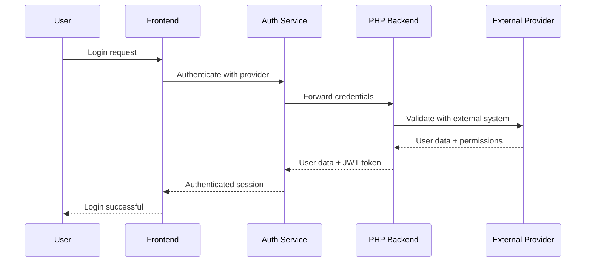

# Synapse API Integration Guide

This comprehensive guide covers the complete API implementation for the Synapse document and demand management system, designed for multi-user environments with external authentication integration.

## Table of Contents

1. [Overview](#overview)
2. [Authentication](#authentication)
3. [Multi-User Collaboration](#multi-user-collaboration)
4. [Transaction Management](#transaction-management)
5. [Data Models](#data-models)
6. [API Endpoints](#api-endpoints)
7. [Error Handling](#error-handling)
8. [Performance Optimization](#performance-optimization)
9. [Testing](#testing)
10. [Deployment](#deployment)

## Overview

The Synapse API provides:

- **Multi-Provider Authentication**: PHP backend, LDAP, OAuth2, SAML support
- **Real-time Collaboration**: WebSocket-based collaboration for 4 simultaneous users
- **Transaction Management**: ACID compliance with distributed transactions
- **Conflict Resolution**: Automatic and manual conflict resolution strategies
- **Performance Monitoring**: Real-time metrics and health checks
- **Comprehensive Caching**: Multi-layer caching with Redis integration

### System Architecture

```
┌─────────────────┐    ┌──────────────────┐    ┌─────────────────┐
│   Frontend      │◄──►│   API Gateway    │◄──►│   PHP Backend   │
│   (React)       │    │   (Node.js/PHP)  │    │   (Laravel)     │
└─────────────────┘    └──────────────────┘    └─────────────────┘
         │                       │                       │
         │                       ▼                       │
         │              ┌─────────────────┐              │
         │              │   WebSocket     │              │
         │              │   Server        │              │
         │              └─────────────────┘              │
         │                       │                       │
         ▼                       ▼                       ▼
┌─────────────────┐    ┌──────────────────┐    ┌─────────────────┐
│   IndexedDB     │    │   Redis Cache    │    │   Database      │
│   (Browser)     │    │   (Distributed)  │    │   (MySQL/PG)    │
└─────────────────┘    └──────────────────┘    └─────────────────┘
```

## Authentication

### 1. Authentication Flow



### 2. Authentication Providers

#### PHP Backend (Laravel)

```php
<?php
// routes/api.php
Route::prefix('auth')->group(function () {
    Route::post('/login', [AuthController::class, 'login']);
    Route::post('/refresh', [AuthController::class, 'refresh']);
    Route::post('/logout', [AuthController::class, 'logout']);
    Route::get('/user', [AuthController::class, 'user'])->middleware('auth:sanctum');
});

// app/Http/Controllers/Api/AuthController.php
class AuthController extends Controller
{
    public function login(Request $request)
    {
        $request->validate([
            'username' => 'required|string',
            'password' => 'required|string',
        ]);

        // Multi-provider authentication logic
        $provider = $request->input('provider', 'default');
        $authService = app("auth.provider.{$provider}");
        
        $result = $authService->authenticate(
            $request->input('username'),
            $request->input('password')
        );

        if (!$result['success']) {
            return response()->json([
                'success' => false,
                'error' => 'Credenciais inválidas',
                'error_code' => 'INVALID_CREDENTIALS'
            ], 401);
        }

        $user = $result['user'];
        $token = $user->createToken('synapse-access', ['*'], 
            Carbon::now()->addSeconds(config('auth.token_lifetime', 28800))
        )->plainTextToken;

        return response()->json([
            'success' => true,
            'user' => [
                'id' => (string) $user->id,
                'username' => $user->username ?? $user->email,
                'email' => $user->email,
                'display_name' => $user->name,
                'first_name' => $user->first_name,
                'last_name' => $user->last_name,
                'department' => $user->department,
                'role' => $user->role,
                'permissions' => $user->getAllPermissions()->pluck('name')->toArray(),
                'groups' => $user->getRoleNames()->toArray(),
                'is_active' => $user->is_active,
                'last_login_at' => $user->updated_at->toISOString(),
            ],
            'token' => $token,
            'expires_in' => config('auth.token_lifetime', 28800)
        ]);
    }
}
```

#### LDAP Integration

```php
<?php
// app/Services/Auth/LdapAuthProvider.php
class LdapAuthProvider implements AuthProviderInterface
{
    private $connection;
    
    public function __construct()
    {
        $this->connection = ldap_connect(config('auth.ldap.host'));
        ldap_set_option($this->connection, LDAP_OPT_PROTOCOL_VERSION, 3);
    }

    public function authenticate(string $username, string $password): array
    {
        $userDn = $this->findUserDn($username);
        
        if (!$userDn || !@ldap_bind($this->connection, $userDn, $password)) {
            return ['success' => false, 'error' => 'Authentication failed'];
        }

        $userData = $this->getUserData($userDn);
        $user = $this->syncUser($userData);

        return ['success' => true, 'user' => $user];
    }

    private function findUserDn(string $username): ?string
    {
        $searchFilter = str_replace('{username}', $username, config('auth.ldap.search_filter'));
        $search = ldap_search($this->connection, config('auth.ldap.base_dn'), $searchFilter);
        
        if (!$search || ldap_count_entries($this->connection, $search) === 0) {
            return null;
        }

        $entries = ldap_get_entries($this->connection, $search);
        return $entries[0]['dn'] ?? null;
    }
}
```

### 3. Frontend Authentication Integration

```typescript
// src/services/auth/authService.ts
import { createAuthConfig } from './config';
import ExternalAuthAdapter from './externalAuthAdapter';

class AuthService {
  private adapter: ExternalAuthAdapter;

  constructor() {
    const config = createAuthConfig();
    this.adapter = new ExternalAuthAdapter(config, permissionMapping);
  }

  async login(username: string, password: string): Promise<AuthResult> {
    try {
      const response = await this.adapter.authenticate(username, password);
      
      if (response.success && response.user && response.token) {
        // Store auth data
        localStorage.setItem('auth_token', response.token);
        localStorage.setItem('user_data', JSON.stringify(response.user));
        
        // Set up auto-refresh
        this.setupTokenRefresh(response.expiresIn || 3600);
        
        return {
          success: true,
          user: response.user,
          token: response.token
        };
      }
      
      return {
        success: false,
        error: response.error || 'Authentication failed'
      };
    } catch (error) {
      return {
        success: false,
        error: error instanceof Error ? error.message : 'Network error'
      };
    }
  }

  private setupTokenRefresh(expiresIn: number): void {
    // Refresh token 5 minutes before expiry
    const refreshTime = (expiresIn - 300) * 1000;
    
    setTimeout(async () => {
      try {
        await this.refreshToken();
      } catch (error) {
        console.error('Token refresh failed:', error);
        // Redirect to login
        window.location.href = '/login';
      }
    }, refreshTime);
  }
}
```

## Multi-User Collaboration

### 1. WebSocket Integration

```javascript
// Backend WebSocket server (Node.js)
const WebSocket = require('ws');
const Redis = require('redis');

class CollaborationServer {
  constructor() {
    this.wss = new WebSocket.Server({ port: 8080 });
    this.redis = Redis.createClient();
    this.rooms = new Map(); // entityType:entityId -> Set of connections
    this.userSessions = new Map(); // userId -> connection info
    
    this.setupWebSocketHandlers();
  }

  setupWebSocketHandlers() {
    this.wss.on('connection', (ws, request) => {
      ws.on('message', async (message) => {
        try {
          const data = JSON.parse(message);
          await this.handleMessage(ws, data);
        } catch (error) {
          this.sendError(ws, 'Invalid message format');
        }
      });

      ws.on('close', () => {
        this.handleDisconnection(ws);
      });
    });
  }

  async handleMessage(ws, data) {
    switch (data.type) {
      case 'join':
        await this.handleJoin(ws, data);
        break;
      case 'edit':
        await this.handleEdit(ws, data);
        break;
      case 'lock':
        await this.handleLock(ws, data);
        break;
      case 'unlock':
        await this.handleUnlock(ws, data);
        break;
    }
  }

  async handleJoin(ws, data) {
    const { entityType, entityId, userId, userName } = data;
    const roomKey = `${entityType}:${entityId}`;
    
    // Add to room
    if (!this.rooms.has(roomKey)) {
      this.rooms.set(roomKey, new Set());
    }
    this.rooms.get(roomKey).add(ws);
    
    // Store user session
    ws.userId = userId;
    ws.userName = userName;
    ws.roomKey = roomKey;
    
    // Notify other users
    this.broadcast(roomKey, {
      type: 'user_joined',
      userId,
      userName,
      timestamp: Date.now()
    }, ws);

    // Send current room state
    this.sendToUser(ws, {
      type: 'room_state',
      users: this.getRoomUsers(roomKey),
      locks: await this.getRoomLocks(roomKey)
    });
  }

  async handleEdit(ws, data) {
    const { entityType, entityId, field, value, version } = data;
    
    // Check for conflicts
    const currentVersion = await this.redis.get(`version:${entityType}:${entityId}`);
    if (currentVersion && parseInt(currentVersion) !== version) {
      return this.sendError(ws, 'Version conflict detected');
    }

    // Apply edit
    await this.redis.set(`data:${entityType}:${entityId}:${field}`, JSON.stringify(value));
    await this.redis.incr(`version:${entityType}:${entityId}`);

    // Broadcast to room
    this.broadcast(ws.roomKey, {
      type: 'edit_applied',
      entityType,
      entityId,
      field,
      value,
      version: version + 1,
      userId: ws.userId,
      timestamp: Date.now()
    }, ws);
  }
}
```

### 2. Frontend Collaboration Integration

```typescript
// src/services/collaboration/collaborationClient.ts
class CollaborationClient {
  private ws: WebSocket | null = null;
  private reconnectAttempts = 0;
  private maxReconnectAttempts = 5;
  private callbacks = new Map<string, Function[]>();

  async connect(userId: string, userName: string): Promise<void> {
    return new Promise((resolve, reject) => {
      try {
        this.ws = new WebSocket(this.getWebSocketUrl());
        
        this.ws.onopen = () => {
          console.log('WebSocket connected');
          this.reconnectAttempts = 0;
          resolve();
        };

        this.ws.onmessage = (event) => {
          try {
            const data = JSON.parse(event.data);
            this.handleMessage(data);
          } catch (error) {
            console.error('Failed to parse WebSocket message:', error);
          }
        };

        this.ws.onclose = () => {
          this.handleDisconnection();
        };

        this.ws.onerror = (error) => {
          console.error('WebSocket error:', error);
          reject(error);
        };
      } catch (error) {
        reject(error);
      }
    });
  }

  joinEntity(entityType: string, entityId: number): void {
    if (!this.ws || this.ws.readyState !== WebSocket.OPEN) {
      throw new Error('WebSocket not connected');
    }

    this.send({
      type: 'join',
      entityType,
      entityId,
      userId: this.getCurrentUserId(),
      userName: this.getCurrentUserName()
    });
  }

  broadcastEdit(entityType: string, entityId: number, field: string, value: any, version: number): void {
    this.send({
      type: 'edit',
      entityType,
      entityId,
      field,
      value,
      version
    });
  }

  on(eventType: string, callback: Function): void {
    if (!this.callbacks.has(eventType)) {
      this.callbacks.set(eventType, []);
    }
    this.callbacks.get(eventType)!.push(callback);
  }

  private handleMessage(data: any): void {
    const callbacks = this.callbacks.get(data.type);
    if (callbacks) {
      callbacks.forEach(callback => callback(data));
    }
  }

  private send(data: any): void {
    if (this.ws && this.ws.readyState === WebSocket.OPEN) {
      this.ws.send(JSON.stringify(data));
    }
  }
}
```

## Transaction Management

### 1. Transaction API Implementation

```php
<?php
// app/Http/Controllers/Api/TransactionController.php
class TransactionController extends Controller
{
    private $transactionManager;

    public function __construct(TransactionManager $transactionManager)
    {
        $this->transactionManager = $transactionManager;
    }

    public function begin(Request $request)
    {
        $request->validate([
            'isolation_level' => 'in:read_uncommitted,read_committed,repeatable_read,serializable',
            'timeout' => 'integer|min:1000|max:300000',
            'name' => 'string|max:255'
        ]);

        $transactionId = $this->transactionManager->begin([
            'user_id' => auth()->id(),
            'session_id' => session()->getId(),
            'isolation_level' => $request->input('isolation_level', 'read_committed'),
            'timeout' => $request->input('timeout', 30000),
            'name' => $request->input('name', 'api_transaction')
        ]);

        return response()->json([
            'transaction_id' => $transactionId,
            'expires_at' => now()->addMilliseconds($request->input('timeout', 30000))->toISOString()
        ], 201);
    }

    public function commit($transactionId)
    {
        try {
            $result = $this->transactionManager->commit($transactionId);
            
            return response()->json([
                'success' => true,
                'affected_entities' => $result['affected_entities'],
                'metrics' => $result['metrics']
            ]);
        } catch (TransactionConflictException $e) {
            return response()->json([
                'success' => false,
                'error' => 'Transaction conflict',
                'error_code' => 'CONFLICT',
                'conflict_data' => $e->getConflictData()
            ], 409);
        }
    }

    public function rollback($transactionId)
    {
        $result = $this->transactionManager->rollback($transactionId);
        
        return response()->json([
            'success' => true,
            'rollback_operations' => $result['rollback_operations']
        ]);
    }
}
```

### 2. Frontend Transaction Integration

```typescript
// src/services/transactions/transactionClient.ts
class TransactionClient {
  private baseUrl: string;
  private authToken: string;

  constructor(baseUrl: string, authToken: string) {
    this.baseUrl = baseUrl;
    this.authToken = authToken;
  }

  async beginTransaction(options?: {
    isolationLevel?: string;
    timeout?: number;
    name?: string;
  }): Promise<string> {
    const response = await fetch(`${this.baseUrl}/transactions`, {
      method: 'POST',
      headers: {
        'Content-Type': 'application/json',
        'Authorization': `Bearer ${this.authToken}`
      },
      body: JSON.stringify(options || {})
    });

    if (!response.ok) {
      throw new Error('Failed to begin transaction');
    }

    const data = await response.json();
    return data.transaction_id;
  }

  async commitTransaction(transactionId: string): Promise<void> {
    const response = await fetch(`${this.baseUrl}/transactions/${transactionId}/commit`, {
      method: 'POST',
      headers: {
        'Authorization': `Bearer ${this.authToken}`
      }
    });

    if (!response.ok) {
      const errorData = await response.json();
      throw new TransactionError(errorData.error, errorData.error_code, errorData);
    }
  }

  async rollbackTransaction(transactionId: string): Promise<void> {
    const response = await fetch(`${this.baseUrl}/transactions/${transactionId}/rollback`, {
      method: 'POST',
      headers: {
        'Authorization': `Bearer ${this.authToken}`
      }
    });

    if (!response.ok) {
      throw new Error('Failed to rollback transaction');
    }
  }

  async executeTransaction<T>(
    operation: (transactionId: string) => Promise<T>,
    options?: { maxRetries?: number }
  ): Promise<T> {
    const maxRetries = options?.maxRetries || 3;
    let lastError: Error;

    for (let attempt = 0; attempt <= maxRetries; attempt++) {
      const transactionId = await this.beginTransaction();
      
      try {
        const result = await operation(transactionId);
        await this.commitTransaction(transactionId);
        return result;
      } catch (error) {
        lastError = error instanceof Error ? error : new Error('Unknown error');
        
        try {
          await this.rollbackTransaction(transactionId);
        } catch (rollbackError) {
          console.error('Rollback failed:', rollbackError);
        }

        // Retry on retryable errors
        if (error instanceof TransactionError && error.retryable && attempt < maxRetries) {
          const delay = Math.min(1000 * Math.pow(2, attempt), 10000);
          await new Promise(resolve => setTimeout(resolve, delay));
          continue;
        }
        
        throw error;
      }
    }
    
    throw lastError!;
  }
}

class TransactionError extends Error {
  constructor(
    message: string,
    public code: string,
    public data: any,
    public retryable: boolean = false
  ) {
    super(message);
    this.name = 'TransactionError';
  }
}
```

## Data Models

### 1. Database Schema (Laravel Migration)

```php
<?php
// database/migrations/create_demandas_table.php
class CreateDemandasTable extends Migration
{
    public function up()
    {
        Schema::create('demandas', function (Blueprint $table) {
            $table->id();
            $table->string('numero')->unique();
            $table->string('titulo');
            $table->text('descricao');
            $table->foreignId('tipo_demanda_id')->constrained();
            $table->foreignId('orgao_solicitante_id')->constrained('orgaos');
            $table->foreignId('assunto_id')->constrained();
            $table->enum('prioridade', ['baixa', 'media', 'alta', 'urgente']);
            $table->enum('status', ['aberta', 'em_andamento', 'aguardando', 'concluida', 'cancelada']);
            $table->timestamp('data_abertura');
            $table->timestamp('data_prazo');
            $table->timestamp('data_conclusao')->nullable();
            $table->text('observacoes')->nullable();
            $table->text('autos_administrativos')->nullable();
            $table->integer('version')->default(1); // For optimistic locking
            $table->timestamps();
            
            // Indexes for performance
            $table->index(['status', 'prioridade']);
            $table->index(['data_abertura', 'data_prazo']);
            $table->index(['orgao_solicitante_id', 'status']);
        });
    }
}

// database/migrations/create_collaboration_locks_table.php
class CreateCollaborationLocksTable extends Migration
{
    public function up()
    {
        Schema::create('collaboration_locks', function (Blueprint $table) {
            $table->id();
            $table->string('entity_type'); // 'demanda', 'documento'
            $table->unsignedBigInteger('entity_id');
            $table->string('user_id');
            $table->timestamp('acquired_at');
            $table->timestamp('expires_at');
            $table->json('metadata')->nullable();
            $table->timestamps();
            
            $table->unique(['entity_type', 'entity_id']);
            $table->index(['expires_at']);
        });
    }
}
```

### 2. Eloquent Models

```php
<?php
// app/Models/Demanda.php
class Demanda extends Model
{
    use HasVersioning, HasCollaboration;

    protected $fillable = [
        'numero', 'titulo', 'descricao', 'tipo_demanda_id',
        'orgao_solicitante_id', 'assunto_id', 'prioridade',
        'status', 'data_abertura', 'data_prazo', 'data_conclusao',
        'observacoes', 'autos_administrativos'
    ];

    protected $casts = [
        'data_abertura' => 'datetime',
        'data_prazo' => 'datetime',
        'data_conclusao' => 'datetime',
        'version' => 'integer'
    ];

    protected $with = ['tipoDemanda', 'orgaoSolicitante', 'assunto'];

    // Relationships
    public function tipoDemanda()
    {
        return $this->belongsTo(TipoDemanda::class);
    }

    public function orgaoSolicitante()
    {
        return $this->belongsTo(Orgao::class);
    }

    public function assunto()
    {
        return $this->belongsTo(Assunto::class);
    }

    public function documentos()
    {
        return $this->hasMany(Documento::class);
    }

    // Optimistic locking
    public function save(array $options = [])
    {
        if ($this->exists && $this->isDirty() && !in_array('version', $this->getDirty())) {
            $this->increment('version');
        }
        
        return parent::save($options);
    }

    // Collaboration support
    public function acquireLock(string $userId, int $timeout = 300): bool
    {
        return CollaborationLock::create([
            'entity_type' => 'demanda',
            'entity_id' => $this->id,
            'user_id' => $userId,
            'acquired_at' => now(),
            'expires_at' => now()->addSeconds($timeout),
        ]);
    }

    public function isLocked(): bool
    {
        return CollaborationLock::where('entity_type', 'demanda')
            ->where('entity_id', $this->id)
            ->where('expires_at', '>', now())
            ->exists();
    }

    public function getLockInfo(): ?array
    {
        $lock = CollaborationLock::where('entity_type', 'demanda')
            ->where('entity_id', $this->id)
            ->where('expires_at', '>', now())
            ->first();

        return $lock ? [
            'user_id' => $lock->user_id,
            'acquired_at' => $lock->acquired_at,
            'expires_at' => $lock->expires_at,
        ] : null;
    }
}

// app/Traits/HasVersioning.php
trait HasVersioning
{
    public function checkVersion(int $expectedVersion): bool
    {
        return $this->version === $expectedVersion;
    }

    public function updateWithVersion(array $attributes, int $expectedVersion): bool
    {
        if (!$this->checkVersion($expectedVersion)) {
            throw new VersionMismatchException($this->version, $expectedVersion);
        }

        return $this->update($attributes);
    }
}

// app/Traits/HasCollaboration.php
trait HasCollaboration
{
    public function getCollaborationInfo(): array
    {
        return [
            'locked_by' => $this->getLockInfo()['user_id'] ?? null,
            'locked_at' => $this->getLockInfo()['acquired_at'] ?? null,
            'lock_expires_at' => $this->getLockInfo()['expires_at'] ?? null,
            'last_modified_by' => $this->updated_by ?? null,
            'last_modified_at' => $this->updated_at,
        ];
    }
}
```

## API Endpoints Implementation

### 1. Demandas Controller

```php
<?php
// app/Http/Controllers/Api/DemandasController.php
class DemandasController extends Controller
{
    use HasTransactions;

    public function index(Request $request)
    {
        $query = Demanda::query();

        // Apply filters
        if ($request->has('status')) {
            $query->whereIn('status', explode(',', $request->status));
        }

        if ($request->has('prioridade')) {
            $query->whereIn('prioridade', explode(',', $request->prioridade));
        }

        if ($request->has('search')) {
            $search = $request->search;
            $query->where(function ($q) use ($search) {
                $q->where('titulo', 'LIKE', "%{$search}%")
                  ->orWhere('descricao', 'LIKE', "%{$search}%")
                  ->orWhere('numero', 'LIKE', "%{$search}%");
            });
        }

        // Date filters
        if ($request->has('data_abertura_inicio')) {
            $query->where('data_abertura', '>=', $request->data_abertura_inicio);
        }

        if ($request->has('data_abertura_fim')) {
            $query->where('data_abertura', '<=', $request->data_abertura_fim);
        }

        // Sorting
        $sortBy = $request->input('sort_by', 'updated_at');
        $sortDirection = $request->input('sort_direction', 'desc');
        $query->orderBy($sortBy, $sortDirection);

        // Pagination
        $perPage = min($request->input('per_page', 10), 100);
        $demandas = $query->paginate($perPage);

        return response()->json($demandas);
    }

    public function store(Request $request)
    {
        $request->validate([
            'numero' => 'required|string|unique:demandas,numero',
            'titulo' => 'required|string|max:255',
            'descricao' => 'required|string',
            'tipo_demanda_id' => 'required|exists:tipo_demandas,id',
            'orgao_solicitante_id' => 'required|exists:orgaos,id',
            'assunto_id' => 'required|exists:assuntos,id',
            'prioridade' => 'required|in:baixa,media,alta,urgente',
            'data_abertura' => 'required|date',
            'data_prazo' => 'required|date|after:data_abertura',
            'observacoes' => 'nullable|string',
            'autos_administrativos' => 'nullable|string',
        ]);

        return $this->executeInTransaction(function () use ($request) {
            $demanda = Demanda::create($request->validated());
            
            // Log creation
            activity('demanda')
                ->performedOn($demanda)
                ->causedBy(auth()->user())
                ->log('created');

            return response()->json([
                'success' => true,
                'data' => $demanda->load(['tipoDemanda', 'orgaoSolicitante', 'assunto']),
                'transaction_id' => $this->getCurrentTransactionId()
            ], 201);
        });
    }

    public function show($id, Request $request)
    {
        $demanda = Demanda::with(['tipoDemanda', 'orgaoSolicitante', 'assunto'])
            ->findOrFail($id);

        // Include collaboration info
        $collaborationInfo = $demanda->getCollaborationInfo();

        // Include related entities if requested
        if ($request->has('include')) {
            $includes = explode(',', $request->include);
            if (in_array('documentos', $includes)) {
                $demanda->load('documentos');
            }
        }

        return response()->json([
            'success' => true,
            'data' => $demanda,
            'collaboration' => $collaborationInfo
        ]);
    }

    public function update(Request $request, $id)
    {
        $demanda = Demanda::findOrFail($id);

        // Check optimistic locking
        $expectedVersion = $request->input('version');
        if ($expectedVersion && !$demanda->checkVersion($expectedVersion)) {
            return response()->json([
                'success' => false,
                'error' => 'Version conflict detected',
                'error_code' => 'VERSION_MISMATCH',
                'current_version' => $demanda->version,
                'your_version' => $expectedVersion
            ], 409);
        }

        $request->validate([
            'titulo' => 'sometimes|string|max:255',
            'descricao' => 'sometimes|string',
            'prioridade' => 'sometimes|in:baixa,media,alta,urgente',
            'status' => 'sometimes|in:aberta,em_andamento,aguardando,concluida,cancelada',
            'data_prazo' => 'sometimes|date',
            'data_conclusao' => 'sometimes|nullable|date',
            'observacoes' => 'sometimes|nullable|string',
            'autos_administrativos' => 'sometimes|nullable|string',
            'version' => 'sometimes|integer'
        ]);

        return $this->executeInTransaction(function () use ($request, $demanda, $expectedVersion) {
            if ($expectedVersion) {
                $demanda->updateWithVersion($request->validated(), $expectedVersion);
            } else {
                $demanda->update($request->validated());
            }

            // Log update
            activity('demanda')
                ->performedOn($demanda)
                ->causedBy(auth()->user())
                ->log('updated');

            // Broadcast update via WebSocket
            $this->broadcastEntityUpdate('demanda', $demanda->id, $demanda->toArray());

            return response()->json([
                'success' => true,
                'data' => $demanda->refresh()->load(['tipoDemanda', 'orgaoSolicitante', 'assunto']),
                'transaction_id' => $this->getCurrentTransactionId()
            ]);
        });
    }

    public function destroy($id)
    {
        $demanda = Demanda::findOrFail($id);

        // Check for dependent records
        if ($demanda->documentos()->count() > 0) {
            return response()->json([
                'success' => false,
                'error' => 'Cannot delete demanda with associated documents',
                'error_code' => 'HAS_DEPENDENCIES'
            ], 409);
        }

        return $this->executeInTransaction(function () use ($demanda) {
            // Log deletion
            activity('demanda')
                ->performedOn($demanda)
                ->causedBy(auth()->user())
                ->log('deleted');

            $demanda->delete();

            return response()->json(null, 204);
        });
    }
}

// app/Traits/HasTransactions.php
trait HasTransactions
{
    private $currentTransactionId;

    protected function executeInTransaction(callable $callback)
    {
        $this->currentTransactionId = app(TransactionManager::class)->begin([
            'user_id' => auth()->id(),
            'session_id' => session()->getId(),
        ]);

        try {
            $result = $callback();
            app(TransactionManager::class)->commit($this->currentTransactionId);
            return $result;
        } catch (Exception $e) {
            app(TransactionManager::class)->rollback($this->currentTransactionId);
            throw $e;
        }
    }

    protected function getCurrentTransactionId(): ?string
    {
        return $this->currentTransactionId;
    }

    protected function broadcastEntityUpdate(string $entityType, $entityId, array $data): void
    {
        // Broadcast via WebSocket or message queue
        event(new EntityUpdated($entityType, $entityId, $data, auth()->id()));
    }
}
```

## Error Handling

### 1. Global Exception Handler

```php
<?php
// app/Exceptions/Handler.php
class Handler extends ExceptionHandler
{
    protected $dontReport = [
        ValidationException::class,
        AuthenticationException::class,
        AuthorizationException::class,
        ModelNotFoundException::class,
        VersionMismatchException::class,
    ];

    public function render($request, Throwable $exception)
    {
        if ($request->expectsJson()) {
            return $this->handleApiException($exception);
        }

        return parent::render($request, $exception);
    }

    private function handleApiException(Throwable $exception): JsonResponse
    {
        switch (true) {
            case $exception instanceof ValidationException:
                return response()->json([
                    'success' => false,
                    'error' => 'Validation failed',
                    'error_code' => 'VALIDATION_ERROR',
                    'errors' => $exception->errors()
                ], 422);

            case $exception instanceof ModelNotFoundException:
                return response()->json([
                    'success' => false,
                    'error' => 'Resource not found',
                    'error_code' => 'NOT_FOUND',
                    'resource_type' => $this->getModelName($exception),
                    'resource_id' => $exception->getIds()
                ], 404);

            case $exception instanceof VersionMismatchException:
                return response()->json([
                    'success' => false,
                    'error' => 'Version conflict detected',
                    'error_code' => 'VERSION_MISMATCH',
                    'current_version' => $exception->getCurrentVersion(),
                    'expected_version' => $exception->getExpectedVersion()
                ], 409);

            case $exception instanceof TransactionConflictException:
                return response()->json([
                    'success' => false,
                    'error' => 'Transaction conflict',
                    'error_code' => 'TRANSACTION_CONFLICT',
                    'conflict_data' => $exception->getConflictData(),
                    'retryable' => $exception->isRetryable()
                ], 409);

            case $exception instanceof LockException:
                return response()->json([
                    'success' => false,
                    'error' => 'Resource is locked',
                    'error_code' => 'RESOURCE_LOCKED',
                    'locked_by' => $exception->getLockedBy(),
                    'lock_expires_at' => $exception->getExpiresAt()
                ], 423);

            default:
                Log::error('Unhandled API exception', [
                    'exception' => get_class($exception),
                    'message' => $exception->getMessage(),
                    'trace' => $exception->getTraceAsString()
                ]);

                return response()->json([
                    'success' => false,
                    'error' => 'Internal server error',
                    'error_code' => 'INTERNAL_ERROR'
                ], 500);
        }
    }

    private function getModelName(ModelNotFoundException $exception): string
    {
        return class_basename($exception->getModel());
    }
}

// Custom exception classes
class VersionMismatchException extends Exception
{
    private $currentVersion;
    private $expectedVersion;

    public function __construct(int $currentVersion, int $expectedVersion)
    {
        $this->currentVersion = $currentVersion;
        $this->expectedVersion = $expectedVersion;
        parent::__construct("Version mismatch: expected {$expectedVersion}, got {$currentVersion}");
    }

    public function getCurrentVersion(): int { return $this->currentVersion; }
    public function getExpectedVersion(): int { return $this->expectedVersion; }
}
```

### 2. Frontend Error Handling

```typescript
// src/services/api/errorHandler.ts
export class APIError extends Error {
  constructor(
    message: string,
    public code: string,
    public status: number,
    public data: any = null,
    public retryable: boolean = false
  ) {
    super(message);
    this.name = 'APIError';
  }
}

export class APIErrorHandler {
  static handle(error: any): APIError {
    if (error.response) {
      const { status, data } = error.response;
      
      switch (status) {
        case 409:
          return new APIError(
            data.error || 'Conflict detected',
            data.error_code || 'CONFLICT',
            status,
            data,
            data.retryable || false
          );
          
        case 422:
          return new APIError(
            'Validation failed',
            'VALIDATION_ERROR',
            status,
            data.errors,
            false
          );
          
        case 423:
          return new APIError(
            'Resource is locked',
            'RESOURCE_LOCKED',
            status,
            data,
            true
          );
          
        default:
          return new APIError(
            data.error || 'Request failed',
            data.error_code || 'REQUEST_FAILED',
            status,
            data,
            status >= 500
          );
      }
    }
    
    return new APIError(
      'Network error',
      'NETWORK_ERROR',
      0,
      null,
      true
    );
  }

  static shouldRetry(error: APIError, attempt: number, maxRetries: number): boolean {
    if (attempt >= maxRetries) return false;
    if (!error.retryable) return false;
    
    // Retry on server errors and network errors
    return error.status >= 500 || error.status === 0;
  }

  static getRetryDelay(attempt: number): number {
    // Exponential backoff with jitter
    const baseDelay = 1000; // 1 second
    const maxDelay = 10000; // 10 seconds
    const delay = Math.min(baseDelay * Math.pow(2, attempt), maxDelay);
    return delay + Math.random() * 1000; // Add jitter
  }
}
```

## Performance Optimization

### 1. Database Optimization

```php
<?php
// database/migrations/add_indexes_for_performance.php
class AddIndexesForPerformance extends Migration
{
    public function up()
    {
        // Composite indexes for common queries
        Schema::table('demandas', function (Blueprint $table) {
            $table->index(['status', 'prioridade', 'updated_at'], 'demandas_status_priority_updated');
            $table->index(['orgao_solicitante_id', 'status', 'data_abertura'], 'demandas_orgao_status_date');
            $table->index(['data_abertura', 'data_prazo'], 'demandas_date_range');
        });

        Schema::table('documentos', function (Blueprint $table) {
            $table->index(['demanda_id', 'status', 'data_criacao'], 'documentos_demanda_status_date');
            $table->index(['status', 'data_criacao'], 'documentos_status_created');
        });

        // Full-text search indexes
        DB::statement('CREATE FULLTEXT INDEX demandas_search ON demandas(titulo, descricao, numero)');
        DB::statement('CREATE FULLTEXT INDEX documentos_search ON documentos(numero, assunto, conteudo)');
    }
}

// app/Http/Controllers/Api/DemandasController.php (optimized queries)
class DemandasController extends Controller
{
    public function index(Request $request)
    {
        $query = Demanda::query();

        // Use eager loading to prevent N+1 queries
        $query->with(['tipoDemanda:id,nome', 'orgaoSolicitante:id,nome,sigla', 'assunto:id,nome']);

        // Optimize full-text search
        if ($request->has('search')) {
            $search = $request->search;
            $query->whereRaw(
                'MATCH(titulo, descricao, numero) AGAINST(? IN BOOLEAN MODE)',
                ["*{$search}*"]
            );
        }

        // Use database-level filtering for better performance
        if ($request->has('status')) {
            $statuses = explode(',', $request->status);
            $query->whereIn('status', $statuses);
        }

        // Optimize date range queries
        if ($request->has('data_abertura_inicio') || $request->has('data_abertura_fim')) {
            $query->whereBetween('data_abertura', [
                $request->input('data_abertura_inicio', '1970-01-01'),
                $request->input('data_abertura_fim', now()->format('Y-m-d'))
            ]);
        }

        // Use cursor pagination for better performance with large datasets
        if ($request->has('cursor')) {
            return $this->cursorPaginate($query, $request);
        }

        return $query->paginate($request->input('per_page', 10));
    }

    private function cursorPaginate($query, Request $request)
    {
        $perPage = min($request->input('per_page', 10), 100);
        $cursor = $request->input('cursor');
        
        if ($cursor) {
            $query->where('id', '>', $cursor);
        }
        
        $results = $query->orderBy('id')->limit($perPage + 1)->get();
        $hasMore = $results->count() > $perPage;
        
        if ($hasMore) {
            $results->pop();
        }
        
        return response()->json([
            'data' => $results,
            'has_more' => $hasMore,
            'next_cursor' => $hasMore ? $results->last()->id : null
        ]);
    }
}
```

### 2. Caching Strategy

```php
<?php
// app/Services/CacheService.php
class CacheService
{
    private $redis;
    private $defaultTTL = 3600; // 1 hour

    public function __construct()
    {
        $this->redis = Redis::connection();
    }

    public function remember(string $key, callable $callback, ?int $ttl = null): mixed
    {
        $cachedValue = $this->redis->get($key);
        
        if ($cachedValue !== null) {
            return unserialize($cachedValue);
        }
        
        $value = $callback();
        $this->redis->setex($key, $ttl ?? $this->defaultTTL, serialize($value));
        
        return $value;
    }

    public function tags(array $tags): self
    {
        // Implement tag-based caching for easier invalidation
        return new TaggedCacheService($this->redis, $tags);
    }

    public function invalidateByTag(string $tag): void
    {
        $keys = $this->redis->smembers("tag:{$tag}");
        if (!empty($keys)) {
            $this->redis->del(...$keys);
            $this->redis->del("tag:{$tag}");
        }
    }
}

// app/Http/Controllers/Api/DemandasController.php (with caching)
class DemandasController extends Controller
{
    private $cache;

    public function __construct(CacheService $cache)
    {
        $this->cache = $cache;
    }

    public function index(Request $request)
    {
        $cacheKey = 'demandas:list:' . md5(serialize($request->all()));
        
        return $this->cache->tags(['demandas', 'demandas_list'])
            ->remember($cacheKey, function () use ($request) {
                // Expensive database query
                return $this->buildDemandasQuery($request)->paginate(
                    $request->input('per_page', 10)
                );
            }, 300); // Cache for 5 minutes
    }

    public function update(Request $request, $id)
    {
        $result = $this->executeInTransaction(function () use ($request, $id) {
            $demanda = Demanda::findOrFail($id);
            $demanda->update($request->validated());
            
            // Invalidate related caches
            $this->cache->invalidateByTag('demandas');
            $this->cache->invalidateByTag("demanda:{$id}");
            
            return $demanda;
        });
        
        return response()->json(['success' => true, 'data' => $result]);
    }
}
```

## Testing

### 1. API Testing (PHPUnit)

```php
<?php
// tests/Feature/Api/DemandasApiTest.php
class DemandasApiTest extends TestCase
{
    use RefreshDatabase, WithFaker;

    protected function setUp(): void
    {
        parent::setUp();
        
        $this->user = User::factory()->create([
            'permissions' => ['demandas:read', 'demandas:create', 'demandas:update']
        ]);
        
        $this->actingAs($this->user);
    }

    public function test_can_list_demandas()
    {
        Demanda::factory()->count(5)->create();
        
        $response = $this->getJson('/api/demandas');
        
        $response->assertStatus(200)
            ->assertJsonStructure([
                'data' => [
                    '*' => [
                        'id', 'numero', 'titulo', 'status', 'prioridade',
                        'created_at', 'updated_at'
                    ]
                ],
                'meta' => ['current_page', 'total'],
                'links' => []
            ]);
    }

    public function test_can_create_demanda_with_transaction()
    {
        $data = [
            'numero' => 'DEM-2024-001',
            'titulo' => 'Test Demanda',
            'descricao' => 'Test description',
            'tipo_demanda_id' => TipoDemanda::factory()->create()->id,
            'orgao_solicitante_id' => Orgao::factory()->create()->id,
            'assunto_id' => Assunto::factory()->create()->id,
            'prioridade' => 'alta',
            'data_abertura' => now()->toISOString(),
            'data_prazo' => now()->addDays(30)->toISOString(),
        ];
        
        $response = $this->postJson('/api/demandas', $data);
        
        $response->assertStatus(201)
            ->assertJson([
                'success' => true,
                'data' => [
                    'numero' => 'DEM-2024-001',
                    'titulo' => 'Test Demanda'
                ]
            ])
            ->assertJsonHas('transaction_id');
            
        $this->assertDatabaseHas('demandas', [
            'numero' => 'DEM-2024-001',
            'titulo' => 'Test Demanda'
        ]);
    }

    public function test_optimistic_locking_prevents_concurrent_updates()
    {
        $demanda = Demanda::factory()->create(['version' => 1]);
        
        // Simulate concurrent update attempt with stale version
        $response = $this->putJson("/api/demandas/{$demanda->id}", [
            'titulo' => 'Updated Title',
            'version' => 1 // Stale version
        ]);
        
        // First update should succeed
        $response->assertStatus(200);
        
        // Second update with same version should fail
        $response = $this->putJson("/api/demandas/{$demanda->id}", [
            'titulo' => 'Another Update',
            'version' => 1 // Stale version
        ]);
        
        $response->assertStatus(409)
            ->assertJson([
                'success' => false,
                'error_code' => 'VERSION_MISMATCH'
            ]);
    }

    public function test_collaboration_locking()
    {
        $demanda = Demanda::factory()->create();
        
        // Acquire lock
        $response = $this->postJson('/api/collaboration/lock', [
            'entity_type' => 'demanda',
            'entity_id' => $demanda->id
        ]);
        
        $response->assertStatus(200)
            ->assertJsonHas('lock_id');
        
        // Try to acquire lock with different user
        $anotherUser = User::factory()->create();
        $response = $this->actingAs($anotherUser)
            ->postJson('/api/collaboration/lock', [
                'entity_type' => 'demanda',
                'entity_id' => $demanda->id
            ]);
        
        $response->assertStatus(423)
            ->assertJson([
                'success' => false,
                'error_code' => 'RESOURCE_LOCKED'
            ]);
    }

    public function test_transaction_rollback_on_error()
    {
        $demanda = Demanda::factory()->create();
        
        // Mock transaction manager to force rollback
        $transactionManager = Mockery::mock(TransactionManager::class);
        $transactionManager->shouldReceive('begin')->once()->andReturn('test-txn-id');
        $transactionManager->shouldReceive('rollback')->once();
        $this->app->instance(TransactionManager::class, $transactionManager);
        
        // Trigger validation error that should rollback transaction
        $response = $this->putJson("/api/demandas/{$demanda->id}", [
            'titulo' => '', // Invalid empty title
        ]);
        
        $response->assertStatus(422);
        
        // Verify original data is unchanged
        $demanda->refresh();
        $this->assertNotEmpty($demanda->titulo);
    }
}

// tests/Feature/Api/AuthenticationApiTest.php
class AuthenticationApiTest extends TestCase
{
    public function test_external_authentication_flow()
    {
        // Mock external auth provider
        $mockProvider = Mockery::mock(ExternalAuthProvider::class);
        $mockProvider->shouldReceive('authenticate')
            ->with('testuser', 'password')
            ->andReturn([
                'success' => true,
                'user' => [
                    'id' => '123',
                    'username' => 'testuser',
                    'email' => 'testuser@company.com',
                    'display_name' => 'Test User',
                    'permissions' => ['demandas:read', 'demandas:create'],
                    'groups' => ['users'],
                    'is_active' => true
                ]
            ]);
            
        $this->app->instance('auth.provider.test', $mockProvider);
        
        $response = $this->postJson('/api/auth/login', [
            'username' => 'testuser',
            'password' => 'password',
            'provider' => 'test'
        ]);
        
        $response->assertStatus(200)
            ->assertJson([
                'success' => true,
                'user' => [
                    'username' => 'testuser',
                    'email' => 'testuser@company.com'
                ]
            ])
            ->assertJsonHas('token');
    }
}
```

### 2. Frontend Testing (Jest + React Testing Library)

```typescript
// src/services/api/__tests__/apiClient.test.ts
describe('API Client', () => {
  let apiClient: APIClient;
  let mockAxios: jest.Mocked<typeof axios>;

  beforeEach(() => {
    mockAxios = axios as jest.Mocked<typeof axios>;
    apiClient = new APIClient('http://localhost:8000/api', 'test-token');
  });

  describe('Demandas', () => {
    it('should list demandas with filters', async () => {
      const mockResponse = {
        data: {
          data: [
            { id: 1, numero: 'DEM-2024-001', titulo: 'Test Demanda' }
          ],
          meta: { current_page: 1, total: 1 }
        }
      };

      mockAxios.get.mockResolvedValue(mockResponse);

      const result = await apiClient.demandas.list({
        status: ['aberta', 'em_andamento'],
        page: 1,
        per_page: 10
      });

      expect(mockAxios.get).toHaveBeenCalledWith('/demandas', {
        params: {
          status: 'aberta,em_andamento',
          page: 1,
          per_page: 10
        }
      });

      expect(result.data).toHaveLength(1);
      expect(result.data[0].numero).toBe('DEM-2024-001');
    });

    it('should handle optimistic locking conflicts', async () => {
      const conflictError = {
        response: {
          status: 409,
          data: {
            success: false,
            error_code: 'VERSION_MISMATCH',
            current_version: 2,
            your_version: 1
          }
        }
      };

      mockAxios.put.mockRejectedValue(conflictError);

      await expect(
        apiClient.demandas.update(1, { titulo: 'Updated' }, 1)
      ).rejects.toThrow('Version conflict detected');
    });
  });

  describe('Transactions', () => {
    it('should execute transaction with retry on failure', async () => {
      let attempts = 0;
      const operation = jest.fn().mockImplementation(async () => {
        attempts++;
        if (attempts < 2) {
          throw new APIError('Network error', 'NETWORK_ERROR', 0, null, true);
        }
        return { success: true };
      });

      // Mock transaction endpoints
      mockAxios.post
        .mockResolvedValueOnce({ data: { transaction_id: 'txn-1' } })
        .mockResolvedValueOnce({ data: { transaction_id: 'txn-2' } });
      mockAxios.post
        .mockRejectedValueOnce(new Error('Network error'))
        .mockResolvedValueOnce({ data: { success: true } });

      const result = await apiClient.transactions.execute(operation, { maxRetries: 2 });

      expect(result.success).toBe(true);
      expect(attempts).toBe(2);
    });
  });
});

// src/components/demandas/__tests__/DemandaForm.test.tsx
describe('DemandaForm', () => {
  it('should handle optimistic updates with rollback', async () => {
    const mockUpdateDemanda = jest.fn();
    const mockOnError = jest.fn();

    mockUpdateDemanda
      .mockRejectedValueOnce(new APIError('Conflict', 'CONFLICT', 409, null, false));

    render(
      <DemandaForm
        demanda={{ id: 1, titulo: 'Original Title', version: 1 }}
        onUpdate={mockUpdateDemanda}
        onError={mockOnError}
      />
    );

    // Change title
    const titleInput = screen.getByLabelText(/título/i);
    fireEvent.change(titleInput, { target: { value: 'Updated Title' } });

    // Submit form
    const submitButton = screen.getByRole('button', { name: /salvar/i });
    fireEvent.click(submitButton);

    await waitFor(() => {
      expect(mockUpdateDemanda).toHaveBeenCalledWith(1, { titulo: 'Updated Title' }, 1);
    });

    await waitFor(() => {
      expect(mockOnError).toHaveBeenCalledWith(expect.any(APIError));
      // Verify form reverted to original value
      expect(titleInput.value).toBe('Original Title');
    });
  });

  it('should show collaboration indicators', async () => {
    const collaborationData = {
      locked_by: 'other-user-id',
      locked_at: new Date().toISOString(),
      active_users: [
        { user_id: 'other-user-id', display_name: 'Other User' }
      ]
    };

    render(
      <DemandaForm
        demanda={{ id: 1, titulo: 'Test' }}
        collaboration={collaborationData}
      />
    );

    expect(screen.getByText(/bloqueado por other user/i)).toBeInTheDocument();
    expect(screen.getByText(/other user está editando/i)).toBeInTheDocument();
  });
});
```

## Deployment

### 1. Production Configuration

```yaml
# docker-compose.prod.yml
version: '3.8'
services:
  app:
    build:
      context: .
      dockerfile: Dockerfile.prod
    environment:
      - APP_ENV=production
      - DB_HOST=database
      - REDIS_HOST=redis
      - VITE_AUTH_PROVIDER=php
      - VITE_PHP_BASE_URL=https://api.synapse.local
    depends_on:
      - database
      - redis
    volumes:
      - ./storage:/var/www/storage
    networks:
      - app-network

  nginx:
    image: nginx:alpine
    ports:
      - "80:80"
      - "443:443"
    volumes:
      - ./nginx.conf:/etc/nginx/nginx.conf
      - ./ssl:/etc/nginx/ssl
    depends_on:
      - app
    networks:
      - app-network

  database:
    image: mysql:8.0
    environment:
      - MYSQL_DATABASE=synapse
      - MYSQL_ROOT_PASSWORD=${DB_PASSWORD}
    volumes:
      - mysql_data:/var/lib/mysql
    networks:
      - app-network

  redis:
    image: redis:alpine
    command: redis-server --appendonly yes
    volumes:
      - redis_data:/data
    networks:
      - app-network

  websocket:
    build:
      context: ./websocket
      dockerfile: Dockerfile
    ports:
      - "8080:8080"
    environment:
      - REDIS_HOST=redis
    depends_on:
      - redis
    networks:
      - app-network

volumes:
  mysql_data:
  redis_data:

networks:
  app-network:
    driver: bridge
```

### 2. Environment Variables

```bash
# .env.production
APP_NAME=Synapse
APP_ENV=production
APP_KEY=your-app-key
APP_DEBUG=false
APP_URL=https://synapse.local

# Database
DB_CONNECTION=mysql
DB_HOST=database
DB_PORT=3306
DB_DATABASE=synapse
DB_USERNAME=synapse
DB_PASSWORD=secure-password

# Redis
REDIS_HOST=redis
REDIS_PASSWORD=redis-password
REDIS_PORT=6379

# Authentication
VITE_AUTH_PROVIDER=php
VITE_PHP_BASE_URL=https://api.synapse.local
VITE_AUTH_SESSION_TIMEOUT=28800
VITE_AUTH_ENABLE_SSO=true

# External Auth (LDAP example)
VITE_LDAP_HOST=ldaps://dc.company.local
VITE_LDAP_BASE_DN=ou=users,dc=company,dc=local
VITE_LDAP_BIND_DN=cn=service,ou=services,dc=company,dc=local
VITE_LDAP_BIND_PASSWORD=service-password

# Transactions
VITE_ENABLE_DISTRIBUTED_TRANSACTIONS=true
VITE_TRANSACTION_TIMEOUT=30000
VITE_TRANSACTION_MAX_RETRIES=3

# Collaboration
WEBSOCKET_URL=wss://ws.synapse.local
MAX_CONCURRENT_USERS=4

# Monitoring
HEALTH_CHECK_ENABLED=true
METRICS_ENABLED=true
```

### 3. Deployment Script

```bash
#!/bin/bash
# deploy.sh

set -e

echo "🚀 Starting Synapse deployment..."

# Build production assets
echo "📦 Building frontend assets..."
npm run build

# Run database migrations
echo "🗄️ Running database migrations..."
php artisan migrate --force

# Clear and optimize caches
echo "🔥 Optimizing application..."
php artisan config:cache
php artisan route:cache
php artisan view:cache
php artisan optimize

# Restart services
echo "🔄 Restarting services..."
docker-compose -f docker-compose.prod.yml up -d --build

# Run health checks
echo "🏥 Running health checks..."
sleep 30
curl -f http://localhost/api/system/health || exit 1

# Test authentication
echo "🔐 Testing authentication..."
curl -f -X POST http://localhost/api/auth/login \
  -H "Content-Type: application/json" \
  -d '{"username":"test","password":"test"}' || echo "⚠️  Authentication test failed (expected if no test user)"

# Test WebSocket
echo "🔌 Testing WebSocket connectivity..."
timeout 5 websocket-client ws://localhost:8080 || echo "⚠️  WebSocket test timeout (may be normal)"

echo "✅ Deployment completed successfully!"
echo "📊 Application metrics: http://localhost/api/system/metrics"
echo "🏥 Health status: http://localhost/api/system/health"
```

This comprehensive API integration guide provides everything needed to implement a production-ready multi-user system with external authentication, real-time collaboration, and enterprise-grade features for the Synapse application.